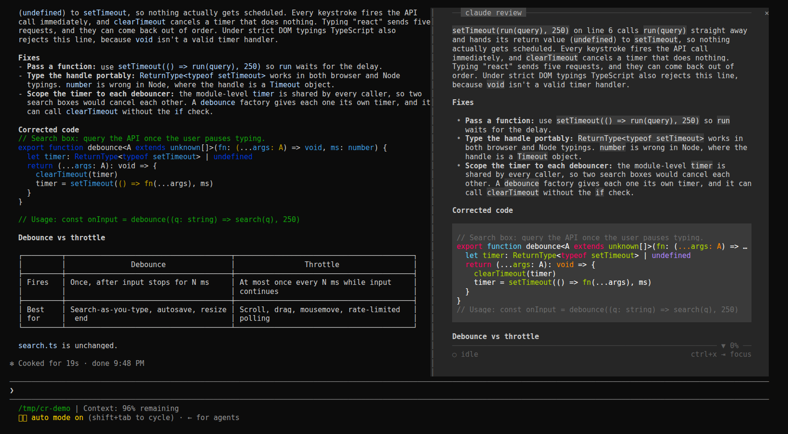

# claude-review


> **Faster than HTML. Calmer than the terminal.**

A reading pane docked inside [Claude Code](https://claude.com/claude-code), beside the conversation. It shows the session's **latest reply**, set for reading in a centred column, and follows the live turn as Claude writes. One line of warm light over the column, the lamp, tells you from the corner of your eye whether Claude is working or waiting on you. Its plan, the question Claude is waiting on, and the task list are one key away.



claude-review is a Claude Code mod: a plugin of function hooks that runs inside Claude Code, so there is no second terminal, no transcript path and nothing to keep in sync.

## Install

```bash
claude plugin marketplace add r3al1tym/claude-review
claude plugin install review-pane@claude-review
```

The next session opens the pane by itself once the terminal is 144 columns or wider. At any width, `/claude-review` opens it and closes it again.

From a clone, link the folder into your skills directory, where Claude Code loads it in every session as `review-pane@skills-dir` and reloads it when you save a file:

```bash
git clone https://github.com/r3al1tym/claude-review ~/src/claude-review
ln -s ~/src/claude-review ~/.claude/skills/review-pane
```

For one session only: `claude --plugin-dir ~/src/claude-review`.

## Use

The pane follows the live turn. Give it the keyboard with ctrl+x then Tab (until you do, its key row says `ctrl+x ⇥ focus`), and Esc hands the keys back.

| Keys | What they do |
| --- | --- |
| `h` `l` | earlier / later turn; an earlier turn leads with the prompt it answered |
| `↑` `↓` `j` `k`, wheel, PgUp PgDn, Home End, `g` | scroll |
| `f` | freeze the view while Claude keeps working; again to unfreeze |
| `r` | back to the live turn |
| `t` | next surface: plan, question, response, tasks, whichever this turn has |
| `y` | copy the surface shown |
| `m` | the guide: every key, plus the session's diagnostics |
| `q` | close the pane |

The lamp is the session's state. While Claude works it is turned down to an ember and breathes slowly; when the turn is done it is up and steady; when a plan or a question waits on you it burns full, and the plan or question leads the page. A new reply settles in: the old page sinks and the new one rises line by line. While a new prompt runs, the last answer stays on the page, dimmed, under your prompt.

A reply longer than the pane gets a fore-edge, a map of the whole reply down the right edge with the rows in view lit, and once you scroll into it the row under the lamp names the section you are in. While the view is frozen or on an earlier turn, `new reply` lights up in the key row when a reply lands on the live turn.

To change the default, set *Open on start* in `/config` (on: the pane opens by itself on a wide terminal; off: only `/claude-review` opens it). `claude plugin disable review-pane@claude-review` turns the mod off everywhere, and `enable` turns it back on.

## How it works

The mod reads the conversation through the hooks API (`$.session.messages()`) and refreshes as rows land (`session.append`), so the pane updates while Claude writes, not only when a turn ends. It writes nothing to the session, makes no network calls and touches no files; `y` puts text on your clipboard through Claude Code.

In the terminal it lays out its own rows (`hooks/markdown.ts`, `hooks/screen.tsx`): a monochrome markdown theme where emphasis comes from weight and a grey ramp and only code keeps its syntax colours, a column of at most 72 cells, the lamp on top and one key row at the bottom. The lamp, the fore-edge and the settle are `Raster` cells repainted by `$.ui.blit` on a timer (`hooks/paint.ts`, `hooks/motion.ts`); a Raster paints at 12-bit colour, so the whole palette is 12-bit and a painted page matches the Text one exactly. The desktop app and VS Code draw the same reply with their own Markdown and buttons.

## Limitations

- **Early access.** Function hooks are an early-access Claude Code surface that may change between releases. This version is checked against Claude Code 2.1.287 with `claude plugin validate .` and `claude plugin test .`.
- **Letter keys.** A pane's keys are letters and digits, so the guide is `m` and surfaces are `t`, and the pane needs the keyboard (ctrl+x then Tab) before they work.
- **No horizontal scroll.** Wide tables shrink their widest columns and wrap.

## The standalone CLI

claude-review began as a Python TUI you ran in a second terminal pane. The mod replaces it. Its last release, v0.5.3, still installs with `pipx install git+https://github.com/r3al1tym/claude-review@v0.5.3`, and its source lives at that tag.

## Contributing

See [CONTRIBUTING.md](CONTRIBUTING.md) for the development loop. Security posture and how to report a vulnerability are in [SECURITY.md](SECURITY.md); the project follows a [Code of Conduct](CODE_OF_CONDUCT.md).

## License

[MIT](LICENSE) © r3al1tym.
